# Homework 1 Responses

Name: Grace Su

## Part 1. MCP
### Brave
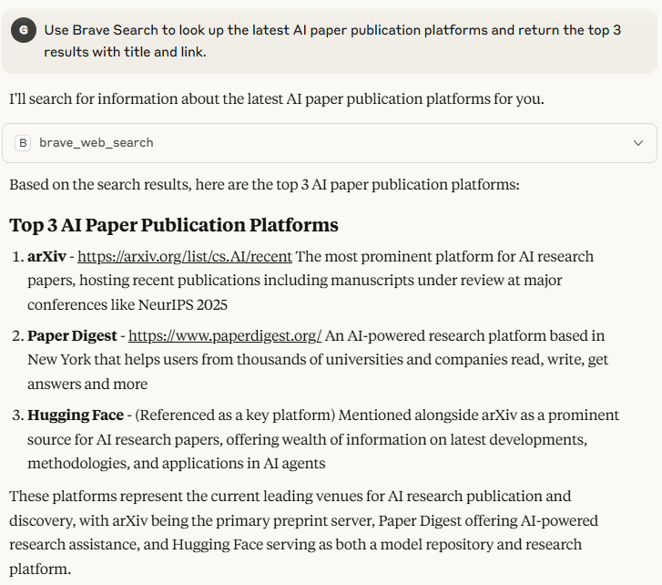

### GitHub
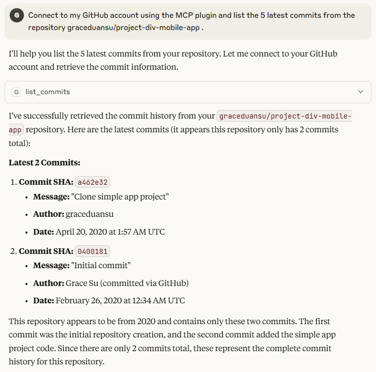

### Puppeteer
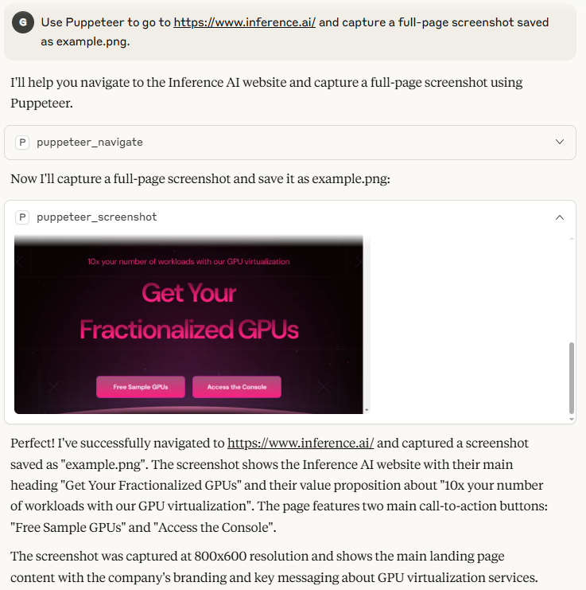

#### example.png

### Filesystem
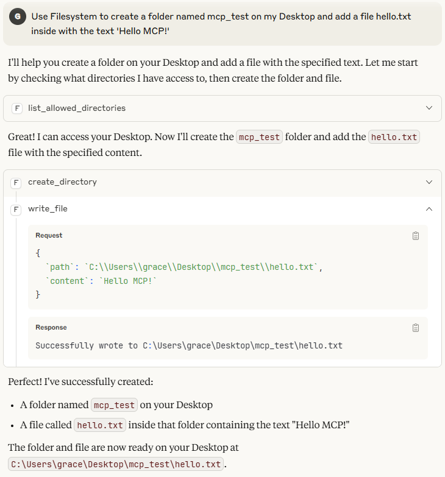
#### hello.txt
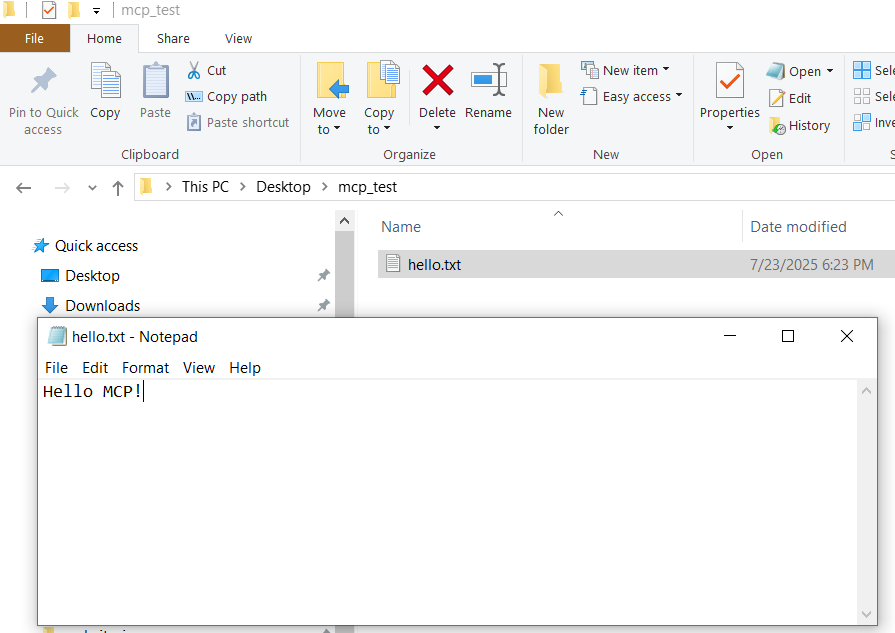

### Sequential Thinking
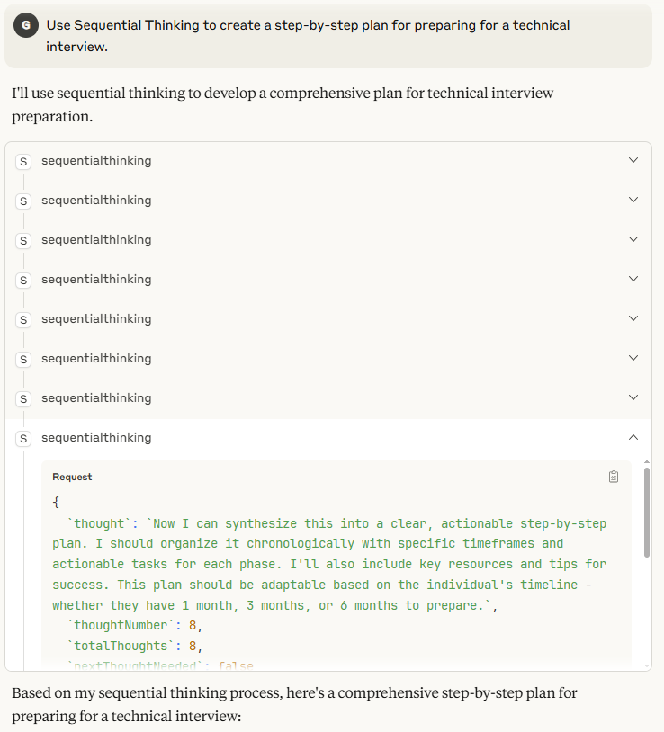
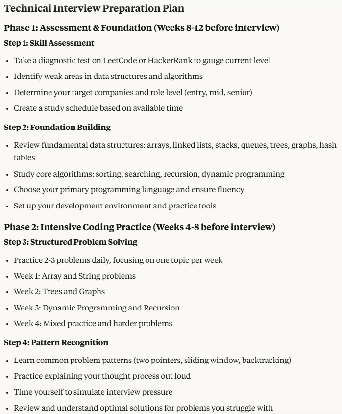
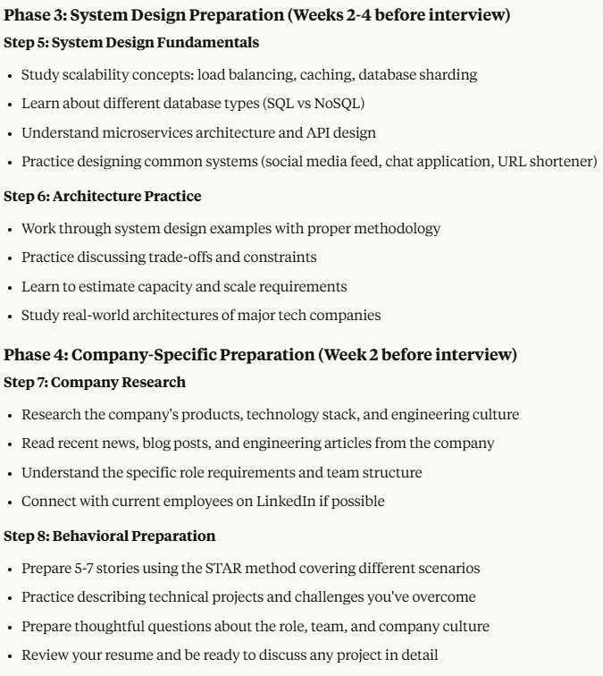
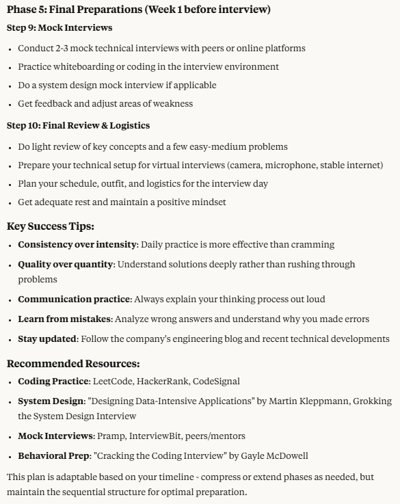

### Notion
**Note**: Task descriptions have been appended to the prompt as each MCP task was completed in a separate chat. 

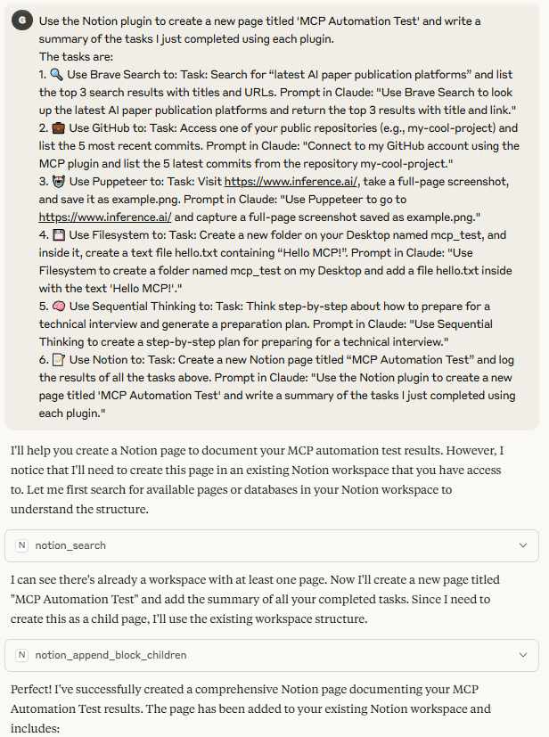
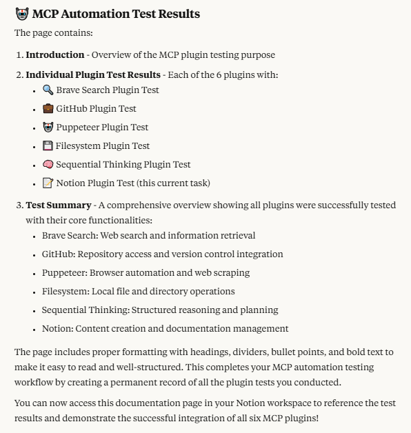

#### Notion Page
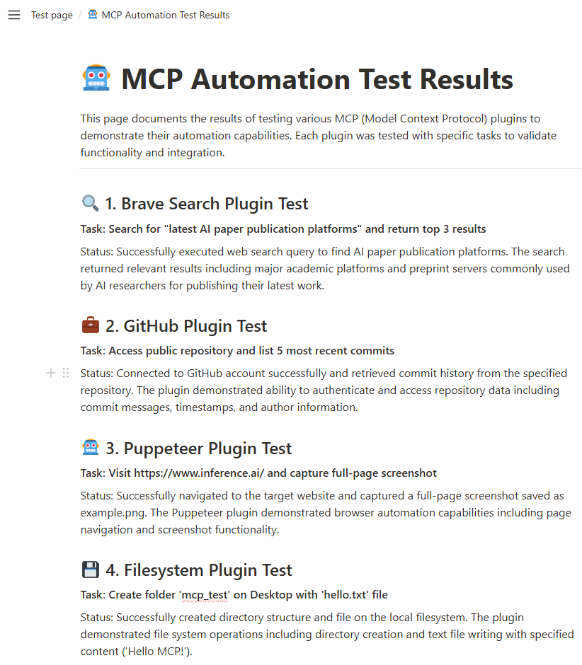
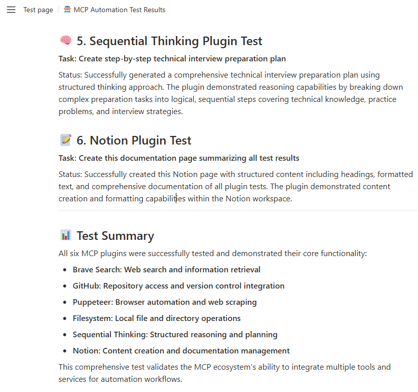

## Part 2. Ollama
### 2.1 Run Ollama locally
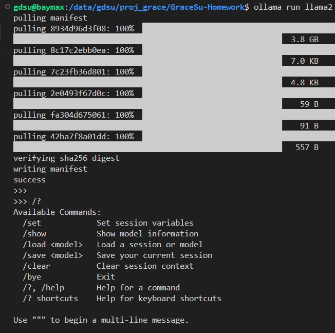
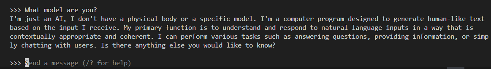

### 2.2 Using Ollama to call OpenAI API
#### Curl method response

{"id":"chatcmpl-337","object":"chat.completion","created":1753494719,"model":"llama2","system_fingerprint":"fp_ollama","choices":[{"index":0,"message":{"role":"assistant","content":"Hello there! It's nice to meet you. How can I assist you today? Do you have any questions or tasks you'd like me to help you with?"},"finish_reason":"stop"}],"usage":{"prompt_tokens":27,"completion_tokens":36,"total_tokens":63}}

#### Python library result
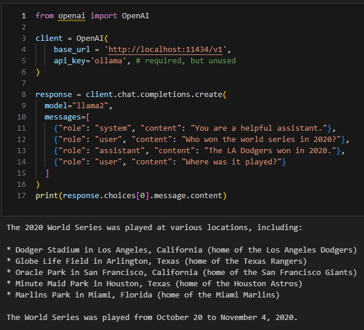

(Also in ["Class 1 Homework.ipynb"](Class%201%20Homework.ipynb))

## Part 3. LangChain
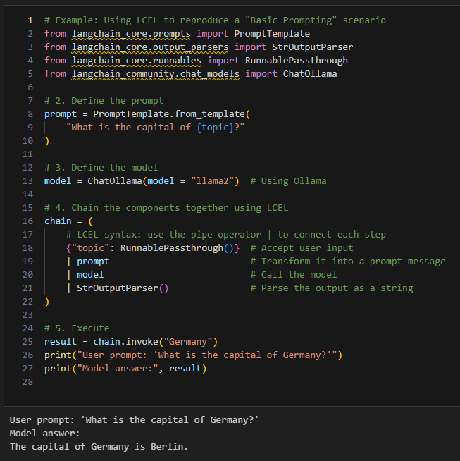

(Also in ["Class 1 Homework.ipynb"](Class%201%20Homework.ipynb))