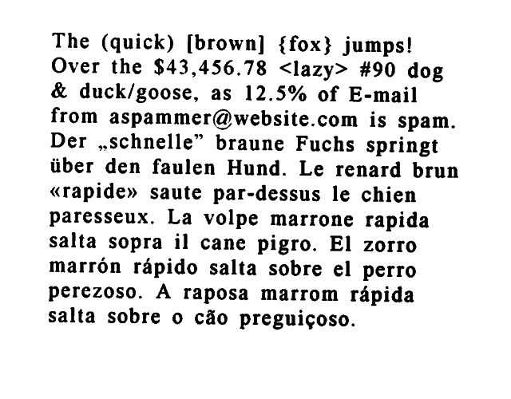

# Homework 2 Responses

Name: Grace Su

## Tesseract OCR
### OCR from command line
```bash
tesseract eurotext.png eurotext.txt
```
| eurotext.png       | eurotext.txt       |
|-------------------|-------------------|
|  | The (quick) [brown] {fox} jumps! Over the $43,456.78 <lazy> #90 dog & duck/goose, as 12.5% of E-mail from aspammer@website.com is spam.Der ,.schnelle” braune Fuchs springt tiber den faulen Hund. Le renard brun «rapide» saute par-dessus le chien paresseux. La volpe marrone rapida salta sopra il cane pigro. El zorro marron rapido salta sobre el perro perezoso. A raposa marrom rapida salta sobre 0 cao preguigoso. |

### OCR from Python
```python
from PIL import Image
import pytesseract #pip install pytesseract first

# Load an image using Pillow (PIL)
image = Image.open('test.webp').convert('L')
# Threshold
threshold = 128
image = image.point( lambda p: 255 if p > threshold else 0 )
# To mono
image = image.convert('1')

# Perform OCR on the image
text = pytesseract.image_to_string(image, lang='eng')

print(text)
```

| test.webp       | Preprocessed image          | Extracted Text       |
|-----------------|-----------------------------|-----------------------|
|  |  | Noisy image to test Tesseract OCR |

