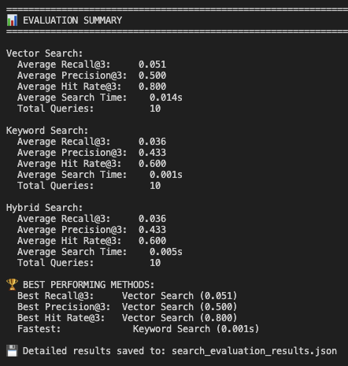

# Homework 5

## Code and Results
The sqlite database construction code is in `sqlite_db.py`.

The FastAPI service is in `main.py`. Run `uvicorn main:app` to start the server. The API endpoint is `http://localhost:8000/hybrid_search?query=your_query&k=3`.

The evaluation code is in `eval_search.py`. Run `python eval_search.py` to evaluate the search results.
The results show that the current hybrid search does not improve over using vector search alone.

## Data
The FAISS index file is `embeddings.index`.
The sqlite database is `arxiv_documents.db`.
The set of text chunks from the 50 processed papers is in `chunks.json`.
The set of papers is in `papers.json`.
